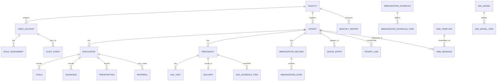

# Architecture — Data Model

**Date:** 2026-06-09
**Author:** Solution architecture (planning)
**Status:** Planned
**Reads with:** `system-architecture.md`, `offline-sync-design.md`, `api-design.md`

---

This is the authoritative data model: entities, relationships, key fields, enums,
the **configurable** immunization/ANC schedules, and the **NHMIS/DHIS2** mapping.
Column lists are representative, not exhaustive — they fix the shape; the build
fills in obvious detail. All tables carry the **common columns** in §2.

> **Editable-config principle (master plan §7.7):** the immunization schedule,
> ANC schedule, SMS templates, and facility list are **data**, owned by admins,
> not hardcoded. The schedules below are *seed defaults* and must be flagged
> "verify against current NPHCDA / WHO guidance" (Open questions Q2, Q3).

---

## 1. Entity-relationship overview



---

## 2. Common columns (every table)

| Column | Type | Notes |
|---|---|---|
| `id` | UUID v4 | **Client-generated** (offline-safe; never auto-increment for synced entities) |
| `facility_id` | UUID | Owning facility (data-scope anchor) |
| `created_at` | timestamptz | |
| `created_by` | UUID (user) | Attribution for audit |
| `updated_at` | timestamptz | Bumped on every change (drives sync) |
| `updated_by` | UUID (user) | |
| `rev` | integer | Monotonic per-record revision (conflict detection) |
| `deleted_at` | timestamptz null | **Soft delete**; never hard-delete clinical data in v1 |
| `origin_device_id` | text | Device that created the row (sync diagnostics) |

> **IDs are UUIDs generated on the client** so records created offline have a
> stable, collision-free identity before ever reaching the hub. See
> `offline-sync-design.md` for why and how `rev`/`updated_at` drive sync.

---

## 3. Core entities

### 3.1 `facility`

| Column | Type | Notes |
|---|---|---|
| `id` | UUID | |
| `code` | text unique | Official PHC/NHMIS facility code (Open question Q1) |
| `name` | text | |
| `type` | enum | `phc`, `health_post`, `model_phc`, `referral` |
| `ward` / `town` | text | Location within Nnewi North LGA |
| `lga` | text | "Nnewi North" (constant in v1; field allows scale-out) |
| `state` | text | "Anambra" |
| `contact_phone` | text | |
| `active` | boolean | |

### 3.2 `user_account` + `role_assignment`

`user_account`: `id`, `full_name`, `username` (unique), `password_hash`,
`pin_hash` (optional, for fast clinic re-auth), `phone`, `status`
(`invited`/`active`/`disabled`), `last_login_at`.

`role_assignment`: `id`, `user_id`, `role` (enum below), `facility_id` (the scope
of this grant; `null` + `scope='lga'`/`'system'` for LGA/system roles).

`role` enum: `records_clerk`, `nurse_midwife`, `chew`, `doctor_mo`,
`facility_admin`, `lga_authority`, `system_admin` (see
`../product/user-roles-and-permissions.md`).

Per-facility configurable permission flags (e.g., `can_prescribe`,
`can_diagnose`, `can_edit_schedule`) live in `facility_permission_config` keyed by
facility + role.

### 3.3 `patient`

| Column | Type | Notes |
|---|---|---|
| `id` | UUID | |
| `mrn` | text unique | System-generated; see §6 for the offline-safe scheme |
| `home_facility_id` | UUID | Where first registered |
| `first_name`, `last_name`, `other_names` | text | |
| `sex` | enum | `female`, `male` |
| `date_of_birth` | date | nullable if only age known |
| `dob_estimated` | boolean | true when DOB derived from stated age |
| `phone_primary` | text | E.164; primary SMS contact |
| `phone_alt` | text | |
| `address_town` / `ward` | text | Within LGA |
| `next_of_kin_name` / `_phone` / `_relation` | text | |
| `occupation` | text | optional |
| `preferred_language` | enum | `en`, `ig` (drives SMS template language) |
| `sms_consent` | boolean | No SMS without this + valid phone |
| `nin` | text | **optional**, format-validated only |
| `photo_ref` | text | optional local/hub image reference |
| `status` | enum | `active`, `inactive`, `deceased` |
| `deceased_date` / `_reason` | date/text | when status = deceased |
| `category_tags` | text[] | e.g. `antenatal`, `child_u5` (routing convenience) |

`patient_link`: `id`, `from_patient_id`, `to_patient_id`, `relation`
(`mother_of`, `child_of`, `guardian_of`) — links mother↔child (created at
delivery), guardians, etc.

`patient_merge`: audit record of a merge — `surviving_id`, `merged_id`,
`merged_by`, `merged_at`, `details` (for Module 10 dedup/merge).

### 3.4 `encounter` (EMR visit) + children

`encounter`: `id`, `patient_id`, `facility_id`, `encounter_date`,
`type` (`general`, `anc`, `immunization`, `pnc`, `outreach`, `emergency`),
`attending_user_id`, `presenting_complaint`, `notes`, `outcome`
(`treated`, `referred`, `admitted`, `followup`), `queue_entry_id?`.

`vitals` (1:N per encounter or 1:1): `temperature_c`, `systolic`, `diastolic`,
`pulse`, `resp_rate`, `weight_kg`, `height_cm`, `muac_mm` (children),
`spo2`, `measured_at`.

`diagnosis`: `encounter_id`, `code` (lightweight ICD-10 subset, optional),
`label` (free text), `is_primary`.

`prescription`: `encounter_id`, `drug` (free text + optional structured),
`dose`, `frequency`, `duration`, `notes`.

`allergy` / `chronic_condition` (patient-level flags shown on summary):
`patient_id`, `label`, `severity?`, `noted_at`, `noted_by`.

`referral`: `id`, `patient_id`, `encounter_id`, `reason`, `destination_facility`
(free text/dest code), `urgency`, `referred_by`, `outcome?`, `outcome_notes?`.

### 3.5 Maternal — `pregnancy`, `anc_visit`, `anc_schedule_item`, `delivery`

`pregnancy`: `id`, `patient_id`, `lmp` (date), `edd` (computed),
`gravida`, `para`, `gestational_age_weeks` (computed at each visit),
`risk_flags` (text[]: `age_risk`, `hypertension`, `grand_multipara`,
`previous_cs`, `danger_sign`…), `status` (`active`, `delivered`, `lost`,
`referred_out`), `outcome_summary?`.

> **EDD computation:** Naegele's rule by default — `EDD = LMP + 280 days`
> (LMP + 7 days − 3 months + 1 year). Gestational age = `(today − LMP)` in
> completed weeks. Make the rule a single shared utility in `packages/shared`.

`anc_schedule_item`: `id`, `pregnancy_id`, `contact_number`, `target_date`,
`window_start`, `window_end`, `status` (`scheduled`, `attended`, `missed`),
`anc_visit_id?`. Generated from the chosen ANC model (§4.2).

`anc_visit`: `id`, `pregnancy_id`, `encounter_id`, `visit_date`,
`gestational_age_weeks`, `weight_kg`, `bp`, `fundal_height_cm`, `fetal_heart_rate`,
`urine_protein`, `urine_glucose`, `pcv_or_hb`, `tt_dose_number?`,
`iptp_dose_number?`, `ifa_given` (bool), `danger_signs` (text[]),
`counselling` (text[]), `next_target_date`.

`delivery`: `id`, `pregnancy_id`, `delivery_date`, `place`
(`facility`, `home`, `other_facility`), `mode` (`svd`, `assisted`, `cs`),
`outcome` (`live_birth`, `still_birth`, `neonatal_death`), `birth_weight_kg?`,
`baby_patient_id?` (set when a newborn record is created), `complications`,
`attended_by`.

### 3.6 Immunization — schedule + records

`immunization_schedule` (config, versioned): `id`, `name`,
`source` (`NPHCDA`, `WHO`, `custom`), `effective_from`, `is_active`, `notes`.

`immunization_schedule_item` (config): `id`, `schedule_id`, `antigen`
(enum below), `dose_label` (e.g. `Penta 1`), `recommended_age_days`,
`min_age_days`, `window_days`, `order`. Default seed schedule in §4.1.

`immunization_record` (per child): `id`, `patient_id`, `schedule_id`
(which schedule applies), `started_at`.

`immunization_dose`: `id`, `immunization_record_id`, `schedule_item_id`,
`antigen`, `dose_label`, `status` (`due`, `given`, `missed`, `not_applicable`),
`due_date` (computed from DOB + schedule item), `given_date?`, `batch_lot?`,
`site?`, `given_by?`, `notes?`.

`aefi` (adverse event): `id`, `immunization_dose_id`, `patient_id`, `description`,
`severity`, `onset_date`, `reported_by`, `action_taken`.

Co-delivered services (commonly recorded on immunization day):
`vitamin_a_dose`, `deworming_dose` (`patient_id`, `date`, `dose`, `given_by`),
and growth uses the `vitals` table (`weight_kg`, `muac_mm`).

### 3.7 Queue — `queue_entry`

`queue_entry`: `id`, `facility_id`, `patient_id`, `queue_date`,
`service` (`general`, `anc`, `immunization`, `pnc`, `other`),
`station` (configurable: `registration`, `vitals`, `consultation`, `pharmacy`…),
`status` (`waiting`, `in_progress`, `completed`, `left_without_being_seen`),
`priority` (`normal`, `priority`, `emergency`), `assigned_user_id?`,
`checked_in_at`, `started_at?`, `completed_at?`. Queue conflict rules: see
`offline-sync-design.md` §6.

### 3.8 SMS — templates, messages

`sms_template`: `id`, `key` (`anc_reminder`, `immunization_reminder`,
`missed_visit_recall`, `general_notice`), `language` (`en`, `ig`), `body`
(with merge fields `{{name}}`, `{{date}}`, `{{facility}}`), `active`, `updated_by`.

`sms_message`: `id`, `patient_id`, `template_key`, `language`, `rendered_body`,
`to_phone`, `status` (`queued`, `sent`, `delivered`, `failed`, `skipped_no_consent`),
`provider` (`africastalking`, `termii`, …), `provider_message_id?`,
`scheduled_for`, `sent_at?`, `delivered_at?`, `error?`, `cost_bucket?`,
`triggered_by` (`reminder_job`, `manual`, `bulk`).

### 3.9 Reporting — `monthly_report`

`monthly_report`: `id`, `facility_id`, `period_year`, `period_month`,
`status` (`draft`, `locked`), `generated_at`, `locked_by?`, `locked_at?`,
`figures` (JSONB: the NHMIS data-element values, see §5), `adjustments` (JSONB,
post-lock corrections tracked separately).

### 3.10 Audit & sync

`audit_event` (append-only): `id`, `actor_user_id`, `action`
(`create`/`update`/`delete`/`login`/`permission_change`/`sensitive_access`/
`merge`/`report_lock`…), `entity_type`, `entity_id`, `facility_id`, `at`,
`details` (JSONB), `device_id`, `ip?`.

`change_log` (server-side sync ledger): `id`, `entity_type`, `entity_id`,
`facility_id`, `op` (`upsert`/`delete`), `rev`, `payload` (JSONB), `server_seq`
(monotonic), `at`, `origin_device_id`. Clients pull by `server_seq` watermark.
Detail in `offline-sync-design.md`.

---

## 4. Seed schedules (editable config — verify against current guidance)

### 4.1 Default immunization (EPI) schedule — *seed; admin-editable; verify vs. current NPHCDA*

> This is a **representative** Nigerian routine-immunization schedule for the
> data model. **Open question Q2:** confirm exact antigens/ages against the
> current NPHCDA schedule before pilot. Stored as `immunization_schedule_item`
> rows; the engine computes per-child due dates from DOB.

| Age (recommended) | Antigens / doses |
|---|---|
| **At birth** | BCG, OPV 0, Hepatitis B birth dose (HepB0) |
| **6 weeks** | Penta 1 (DPT-HepB-Hib), OPV 1, PCV 1, Rotavirus 1 |
| **10 weeks** | Penta 2, OPV 2, PCV 2, Rotavirus 2 |
| **14 weeks** | Penta 3, OPV 3, PCV 3, Rotavirus 3, IPV 1 |
| **9 months** | Measles 1 (MCV1), Yellow Fever, Meningitis A*, Vitamin A |
| **15 months** | Measles 2 (MCV2) |

`antigen` enum (seed): `bcg`, `opv`, `hepb`, `penta`, `pcv`, `rota`, `ipv`,
`measles`, `yellow_fever`, `men_a`, `vitamin_a`. *Items marked with `*` vary by
schedule version — keep configurable.*

**Key reporting indicator the engine must support:** **Penta1 → Measles1 dropout
rate** (a standard EPI quality measure) = (Penta1 given − Measles1 given) /
Penta1 given.

### 4.2 Default ANC model — *seed; admin-editable*

> **Open question Q3.** Ship both as selectable `anc_model` config; default to
> WHO-2016 8-contact, allow focused 4-visit.

`anc_model` = `who_2016_8` (contacts at ~12, 20, 26, 30, 34, 36, 38, 40 weeks)
**or** `focused_4` (≈ once in 1st trimester, ~20–24w, ~28–32w, ~36w). Stored as
`anc_model_item` rows (`contact_number`, `target_ga_weeks`, `window_weeks`); the
engine generates `anc_schedule_item`s from `lmp`/`edd`.

Maternal interventions tracked per visit (for reports): **TT** (tetanus toxoid)
doses, **IPTp** (intermittent preventive treatment in pregnancy, malaria) doses,
**IFA** (iron-folic acid) supplementation, danger-sign screening, referrals.

---

## 5. NHMIS / DHIS2 reporting mapping

The `monthly_report.figures` JSONB holds NHMIS-aligned **data elements**; the
DHIS2 export maps each to its dataElement/category-option-combo (Open question
Q4 — final mapping confirmed with the LGA's DHIS2 config). Representative
elements the engine must compute from source rows:

| Domain | Example data elements (computed) |
|---|---|
| **OPD / attendance** | New attendances, re-attendances, total by sex/age band |
| **ANC** | ANC 1st visits, ANC 4th+ visits, TT2+ given, IPTp1/2/3, IFA, ANC referrals, high-risk identified |
| **Delivery** | Deliveries by skilled attendant, live births, still births, CS referrals |
| **Immunization** | Doses by antigen (BCG, Penta1/2/3, OPV, PCV, Rota, IPV, Measles1/2, YF), fully immunized child, **Penta1→Measles1 dropout**, Vitamin A |
| **Referrals** | Out-referrals by reason |
| **Registrations** | New patients, new under-5s, new pregnancies |

Every figure must **drill down to its source records** (auditability — Module 5
acceptance). The export produces a **DHIS2 import file** (+ CSV/PDF); no live API
integration in v1 unless Q4 says otherwise.

---

## 6. Offline-safe Medical Record Number (MRN)

MRNs must be **unique across facilities** and **generatable offline** (no central
sequence available when the network is down). Scheme:

```text
MRN = <FACILITY_CODE>-<YY><DDD>-<SHORT_RANDOM>
       e.g. NNW07-26159-4F3A
```

- `FACILITY_CODE`: short facility code (guarantees cross-facility uniqueness).
- `YYDDD`: year + day-of-year of registration (human-meaningful, sortable).
- `SHORT_RANDOM`: a few base32 chars from the record UUID (collision-safe within
  a facility-day).

The canonical key everywhere is the **UUID `id`**; the MRN is the human-facing,
print-on-card identifier. The hub verifies MRN uniqueness on sync and, in the
astronomically-rare collision, the UUID still disambiguates and the hub reissues
a suffix (audited). Patient **search** indexes phone, name, and MRN locally.

---

## 7. Indexing & integrity notes

- Local (Dexie) indexes: `patient` by `phone_primary`, `mrn`, name tokens;
  `queue_entry` by `(facility_id, queue_date, status)`; `immunization_dose` by
  `(patient_id, status, due_date)`; `anc_schedule_item` by `(status, target_date)`.
- Server (Postgres) indexes: foreign keys, `change_log(server_seq)`,
  `audit_event(at)`, reporting aggregates by `(facility_id, period)`.
- Referential integrity enforced at the hub; the client tolerates temporarily-
  dangling references during sync and reconciles (offline-sync-design §5).
- **No hard deletes** of clinical data in v1 (soft delete + retention config,
  Open question Q7).
