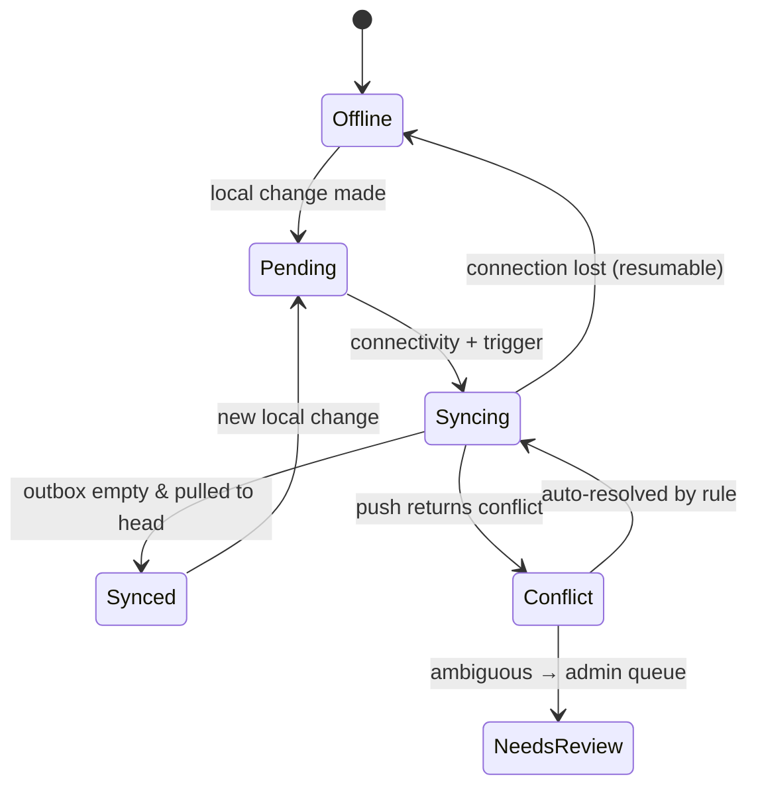

# Architecture — Offline-First & Sync Engine Design

**Date:** 2026-06-09
**Author:** Solution architecture (planning)
**Status:** Planned
**Reads with:** `data-model.md`, `system-architecture.md`, `api-design.md`
**Built in:** Phase 3 (patterns established in Phase 0)

---

This is the most important and highest-risk piece of the system. If sync is
wrong, clinical data is lost or duplicated — unacceptable. This document fixes
the model so the build does not improvise it.

> **Design stance:** the **clinic device is the system of record during a
> session**. The hub is **eventually consistent**. Care never waits for the
> network; the network catches up to care.

---

## 1. Principles

1. **Local-first.** Every read/write hits the on-device store (Dexie/IndexedDB)
   first. The network is never on the critical path for care.
2. **Client-generated identity.** All synced records use **client-generated
   UUIDs** (`data-model.md` §2), so a record created offline has stable identity
   before it ever reaches the hub. No reliance on server auto-increment.
3. **Append-friendly truth.** Clinical history is mostly **additive** (visits,
   doses, ANC contacts). Additive data rarely conflicts — lean into that.
4. **Deterministic conflict rules.** Where two edits race, resolution is
   rule-based and predictable; the rare genuinely-ambiguous case is **escalated
   to an admin, never silently dropped**.
5. **Incremental & resumable.** Sync transfers only changes since the last
   watermark and survives interruption (slow/flaky networks are the norm).
6. **Scoped.** A device only pulls/holds data for the facilities its users are
   authorised for (privacy + small local store).
7. **Idempotent.** Re-sending the same change must not create duplicates
   (`id` + `rev` make upserts idempotent).

---

## 2. Local store layout (client)

Dexie/IndexedDB holds, per facility scope:

- **Domain tables** mirroring the entities in `data-model.md` (patient,
  encounter, pregnancy, anc_visit, immunization_dose, queue_entry, …).
- **Outbox** — the local change-log of mutations not yet acknowledged by the hub:
  `{ localSeq, entity_type, entity_id, op, payload, rev, created_at, status }`
  where `status ∈ {pending, in_flight, acked, conflict}`.
- **Sync meta** — `{ server_seq_watermark, last_sync_at, device_id, scope }`.

All UI writes go through a **repository layer** that (a) writes the domain row,
(b) appends an outbox entry, and (c) bumps the row's `rev` and `updated_at` — in
**one IndexedDB transaction**, so a crash can't half-apply a change.

---

## 3. The sync protocol (pull + push)

Two REST operations against the hub `sync` module (contract in `api-design.md`):

### 3.1 Pull (hub → device)

```text
GET /sync/changes?since=<server_seq_watermark>&scope=<facility_ids>&limit=N
→ { changes: [{ entity_type, entity_id, op, rev, payload, server_seq }...],
    next_seq, has_more }
```

- Client requests changes after its watermark, within its facility scope.
- Applies each change locally with **last-writer rules** (§5), advancing the
  watermark as it goes; **resumable** via `next_seq` if interrupted.

### 3.2 Push (device → hub)

```text
POST /sync/push  { device_id, changes: [{ entity_type, entity_id, op, rev,
                   base_rev, payload, client_ts }...] }
→ { results: [{ entity_id, status: 'applied'|'conflict'|'rejected',
               server_rev, server_payload? }...] }
```

- Client sends pending outbox entries (batched).
- Hub applies each as an **idempotent upsert** keyed by `id`, using `base_rev`
  (the rev the client edited from) to detect concurrent server changes.
- Per-change result tells the client to mark `acked`, or to handle a `conflict`
  (§5), or a `rejected` (validation/permission — surfaced as an error).

### 3.3 When sync runs

- On reconnect (online event), on app focus, on a periodic timer when online,
  on explicit **"Sync now"**, and via the service worker's **Background Sync**
  where supported.
- **Push before pull** within a cycle (so the device's own work is on the hub
  before it pulls others'), then pull to converge. Repeat until both empty.

---

## 4. Sync state machine (UI-visible)



The UI shows: **Offline**, **Pending changes (n)**, **Syncing…**, **Synced
(last: hh:mm)**, **Conflict needs review (n)** — with last-synced timestamp.

---

## 5. Conflict resolution rules

Conflicts are detected at push: the client edited from `base_rev` but the hub's
current `rev` is higher (someone else changed it). Resolution is **per entity
class**, chosen to match clinical reality:

| Entity class | Strategy | Why |
|---|---|---|
| **Append-only clinical events** (encounter, vitals, anc_visit, immunization_dose, referral, sms_message, audit) | **No conflict by construction** — each event is a new row with its own UUID. Two devices recording two visits create two rows, both kept. | Clinical history is additive; never overwrite an event. |
| **Patient demographics** (patient, allergy flags) | **Field-level last-writer-wins by `updated_at`**, with merge of non-overlapping fields where safe; both versions logged. | Demographics are corrections; latest correction usually right, but keep history. |
| **Status/workflow rows** (queue_entry status, anc_schedule_item status, immunization_dose status) | **State-priority merge**: a "more advanced" state wins (e.g., `completed` > `in_progress` > `waiting`; `given` > `due`). Ties → last-writer. | Two stations advancing the same patient should converge forward, not bounce back. |
| **Config** (schedules, templates) | **Hub is authoritative**; client edits to config go through normal API (online), not the offline outbox. | Config changes are admin, low-frequency, coordinate centrally. |
| **Merges/deletes** (patient_merge, soft delete) | **Hub-mediated**; a soft-delete or merge from the hub wins over a concurrent local edit, and the local edit is preserved as history under the surviving record. | Destructive/structural ops must be deterministic and auditable. |

**Escalation:** if field-level merge of demographics produces a *genuine
contradiction* on an identity-critical field (e.g., two different DOBs/sex),
the record is flagged `NeedsReview` and surfaced in the **admin conflict queue**
(Module 10) with both versions; clinical work continues on the latest, but an
admin reconciles. Conflicts are **never silently dropped**.

Every conflict resolution (auto or manual) writes an `audit_event`.

---

## 6. Worked examples

- **Two nurses, two visits, same child, offline:** each device creates a distinct
  `immunization_dose`/`encounter` (own UUID). On sync, both rows land at the hub
  and on both devices. No conflict. ✅
- **Queue advanced on two devices:** Device A marks `in_progress`, Device B marks
  `completed`. State-priority → `completed` wins; both converge. ✅
- **Phone number corrected on two devices:** field-level last-writer by
  `updated_at`; the later correction wins, the earlier is in history. ✅
- **DOB differs between two devices:** identity-critical contradiction →
  `NeedsReview` → admin queue; latest used meanwhile. ⚠️ (human resolves)
- **Same change pushed twice (retry after a dropped response):** idempotent
  upsert by `id` + `rev` → no duplicate. ✅

---

## 7. Initial sync & scope changes

- **First login on a device** (must be online once): the device enrolls, receives
  its facility scope, and pulls a **scoped baseline snapshot** (active patients +
  recent history for its facilities; deep history paged lazily on demand).
- **Scope change** (user reassigned facilities): the device pulls the newly-in-
  scope data and **purges** out-of-scope data on next sync (privacy).
- **Baseline is bounded**: pull *active/recent* by default; older records fetched
  on demand (keeps the local store small on low-end devices — performance budget
  in `tech-stack-recommendation.md` §4).

---

## 8. Failure handling & durability

- **Transactional local writes** (domain row + outbox in one IndexedDB tx) → no
  half-applied changes on crash/refresh.
- **In-flight tracking**: outbox entries marked `in_flight` revert to `pending`
  if no ack (resumable, idempotent re-send).
- **Partial pull**: watermark advances only for applied changes; interrupted
  pull resumes from `next_seq`.
- **Clock skew**: `updated_at` for last-writer uses a consistent source; the hub
  stamps authoritative server time on apply, and `rev` (not wall-clock) is the
  primary conflict signal. Don't trust device clocks for ordering — use `rev` +
  `server_seq`.
- **Poison change**: a change that repeatedly fails validation is parked in a
  local "rejected" state and surfaced to the user/admin rather than blocking the
  whole outbox.

---

## 9. Security of the local store

- The local store contains patient data → treat the device as sensitive (NDPA).
- **Auto-lock** the app after inactivity; require PIN/credential to resume.
- On **logout/deactivation/scope-loss**, purge local data for out-of-scope
  facilities; on device de-enrolment, purge all.
- Consider at-rest protection for the local store (see
  `security-and-compliance.md` — browser-storage encryption options and their
  limits on low-end Android are discussed there).
- Cached offline **auth tokens** are short-TTL-refreshable and revocable at the
  hub on next sync (deactivated users can't sync, and lose offline access at
  next online check).

---

## 10. Testing the sync engine (must-pass before Phase 3 exits)

- **Offline CRUD**: every MVP workflow completes with network disabled, then
  reconciles on reconnect (Playwright with network throttling/offline).
- **No-loss across crash/refresh/airplane cycles** (fuzz the interruption points).
- **Concurrency matrix**: scripted two-device edits per entity class verifying
  each conflict rule in §5, including the escalation path.
- **Idempotency**: replay a push; assert no duplicates.
- **Resumability**: kill a pull/push mid-batch; assert correct resume.
- **Scope**: assert a device never receives/holds out-of-scope data; scope
  change purges correctly.
- **Volume/perf**: baseline snapshot + steady-state sync within the device budget.

---

## 11. Fallback option (documented, not chosen)

If the custom change-log sync proves too costly to harden, the documented
fallback is **CouchDB/PouchDB** replication for the offline domain data, with
Postgres retained for reporting/admin via a projection. This is a **last resort**
(it splits the datastore and complicates RBAC/reporting) and must be a deliberate,
owner-approved pivot, recorded in the change log — not a silent drift.
