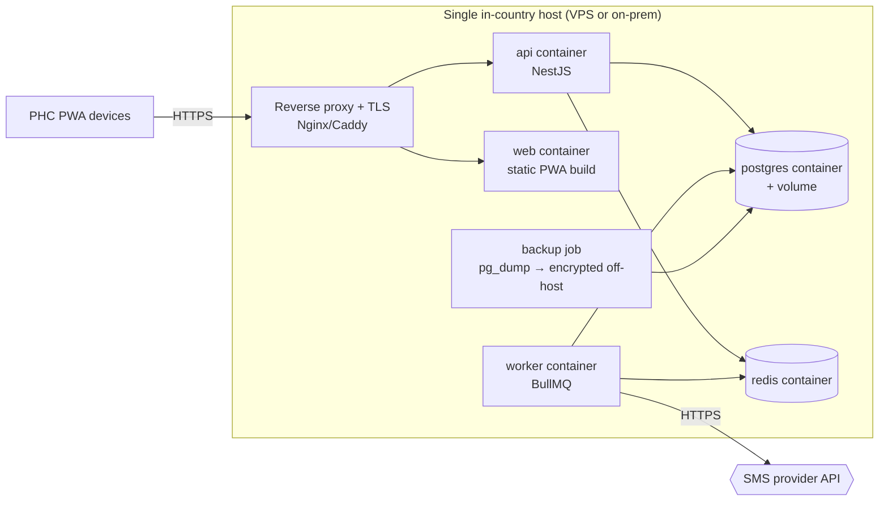

# Architecture — System Architecture

**Date:** 2026-06-09
**Author:** Solution architecture (planning)
**Status:** Planned
**Reads with:** `tech-stack-recommendation.md`, `offline-sync-design.md`, `data-model.md`, `security-and-compliance.md`

---

## 1. Topology overview

The system is a set of **offline-capable PWA clients** at the PHCs talking to a
single **central sync hub** (NestJS + PostgreSQL) hosted **in Nigeria**. The hub
is the authoritative multi-facility store, the SMS dispatcher, the reminder
scheduler, and the reporting engine. Clinics never depend on the hub to do their
work; the hub is for cross-device consistency, cross-facility continuity,
notifications, and reporting.

```mermaid
graph TD
  subgraph Facility A
    A1[PWA device 1\nDexie/IndexedDB\nservice worker]
    A2[PWA device 2]
  end
  subgraph Facility B
    B1[PWA device]
  end
  subgraph CHEW outreach
    C1[PWA device\noffline in community]
  end

  A1 <-- sync REST --> HUB
  A2 <-- sync REST --> HUB
  B1 <-- sync REST --> HUB
  C1 <-- sync REST --> HUB

  subgraph "Sync Hub (in-country, Dockerized)"
    HUB[NestJS API\nAuth · RBAC · Sync · Audit]
    PG[(PostgreSQL 16)]
    REDIS[(Redis)]
    JOBS[BullMQ workers\nreminders · SMS · reports]
    HUB --- PG
    HUB --- REDIS
    JOBS --- REDIS
    JOBS --- PG
  end

  JOBS -- send --> SMSP{{SMS provider\nAfrica's Talking / Termii}}
  SMSP -- delivery webhooks --> HUB
  HUB --> RPT[DHIS2 export files\nCSV / PDF]
  HUB --> ADM[Admin & LGA dashboards\n(served as part of PWA)]
```

---

## 2. Components

### 2.1 PWA client (`apps/web`)

- **App shell** cached by a service worker (Workbox) → loads instantly offline.
- **Local store** (Dexie/IndexedDB): patient, encounter, ANC, immunization,
  queue, and a **local change-log** (outbox) of pending mutations.
- **Local-first repository layer**: all reads/writes go to Dexie first; the UI
  never blocks on the network. A sync module pushes/pulls with the hub.
- **Sync status** surfaced in the UI (synced / pending / syncing / offline /
  conflict; last-synced time).
- **Facility-scoped data** only: a device holds just the facilities its users are
  scoped to (privacy + size).

### 2.2 Sync hub API (`apps/api`)

NestJS modular monolith. Modules map to product modules:

| Nest module | Responsibility |
|---|---|
| `auth` | Login, JWT issue/refresh, PIN, offline-token policy |
| `users` | Staff accounts, roles, facility assignment |
| `facilities` | Facility registry, LGA structure |
| `patients` | Registration, demographics, MRN, dedup/merge, LGA patient index |
| `encounters` | EMR visits, vitals, diagnoses, prescriptions, referrals |
| `maternal` | ANC/PNC episodes, schedule engine, defaulters |
| `immunization` | EPI schedule engine, doses, due/overdue, AEFI |
| `queue` | Daily queue & workflow |
| `sms` | Provider-agnostic SMS, templates, send log |
| `reminders` | Computes & schedules reminder jobs |
| `reporting` | NHMIS summaries, DHIS2 export, dashboards |
| `sync` | Pull/push endpoints, change-log, conflict resolution |
| `audit` | Append-only audit log + interceptor |
| `admin` | Config (schedules, templates, stations), system health |

Cross-cutting: **Auth guard** + **RBAC guard** (role × data-scope) on every
route; **audit interceptor** records sensitive actions; **validation pipe**
(Zod/DTO) rejects malformed input.

### 2.3 PostgreSQL

Authoritative relational store. Holds all facilities' data, the server-side
change-log (for sync), audit log, reporting aggregates. Schema in `data-model.md`.

### 2.4 Redis + BullMQ workers

Background jobs decoupled from request handling:

- **Reminder scheduler**: scans upcoming ANC contacts & immunization due dates,
  enqueues SMS jobs at the right lead time, respects quiet hours.
- **SMS dispatcher**: sends via the configured provider, handles retry/failover,
  records delivery status from provider webhooks.
- **Report generator**: builds monthly summaries / DHIS2 export files on demand
  or on schedule.

### 2.5 SMS provider adapters

A `SmsProvider` interface with `AfricasTalkingAdapter` and `TermiiAdapter`
implementations (and room for Twilio). Selected by config/env. Normalises
phone numbers to E.164 (+234…), maps provider delivery statuses to a common
enum, and exposes a `send(message)` + delivery-callback contract. Detail of the
interface in `api-design.md`.

---

## 3. Deployment model

Everything ships as Docker images, orchestrated by Docker Compose for the v1
single-node, in-country deployment (Open question Q6: NG-region VPS vs. on-prem
LGA server — the same Compose works for both).



Containers: `web` (served statically), `api`, `worker`, `postgres`, `redis`,
reverse proxy (Caddy/Nginx with automatic TLS). A scheduled **encrypted backup**
job ships `pg_dump` snapshots off-host (still in-country). Detail in Phase 10.

### Scaling note

v1 is single-node for one LGA — appropriate and cheap. The design scales by:
splitting the worker out, read-replicas for reporting, and (much later) a
State-level federation where each LGA hub forwards aggregates upward (§9 of the
master plan). None of that is v1 work; the architecture simply doesn't preclude
it.

---

## 4. Connectivity & power assumptions

- **Connectivity is intermittent and sometimes absent at the clinic.** Therefore
  the **clinic device is the primary system of record during a session**; the hub
  is eventually-consistent. (See `offline-sync-design.md`.)
- **Sync happens opportunistically**: when online (background sync via service
  worker, periodic, on app focus, and manual "sync now").
- **The hub is online-only.** SMS, cross-facility lookups, and report generation
  require the hub — these are explicitly the parts that wait for connectivity;
  core care does not.
- **Power**: handled operationally (battery devices, power banks/solar at sites);
  software just doesn't lose data on abrupt shutdown (local store is durable;
  writes are transactional).

---

## 5. Environments

| Env | Purpose | Notes |
|---|---|---|
| **local** | Developer machines | Docker Compose; seed data; no real patient data |
| **staging / preview** | UAT + pilot dry-run | Mirrors prod config; synthetic data; validates sync & reports |
| **production (pilot)** | 1–2 PHCs | In-country host; real data; restricted access; backups on |
| **production (LGA)** | Rollout | Same host scaled; all participating PHCs |

No production patient data in non-production environments. Config via env vars;
**no secrets in the repo** (NDPA + repo hygiene).

---

## 6. Key non-functional requirements

| NFR | Requirement |
|---|---|
| **Offline** | All core care workflows function with no network (Module 9). |
| **Durability** | No data loss on crash/refresh; transactional local writes; nightly hub backups. |
| **Consistency** | Eventually consistent across devices; deterministic conflict rules; conflicts never silently dropped. |
| **Security** | NDPA 2023 aligned; encryption in transit (TLS) and at rest; RBAC + audit (see security doc). |
| **Performance** | Meets the device budget in `tech-stack-recommendation.md` §4. |
| **Availability** | Clinic operation is independent of hub uptime; hub target high but not life-critical. |
| **Maintainability** | One language (TS) end-to-end; shared schemas; modular monolith; documented. |
| **Portability** | Runs on NG VPS or on-prem via the same Compose. |
| **Observability** | Structured logs, sync metrics, SMS delivery metrics, audit log, health endpoints. |
