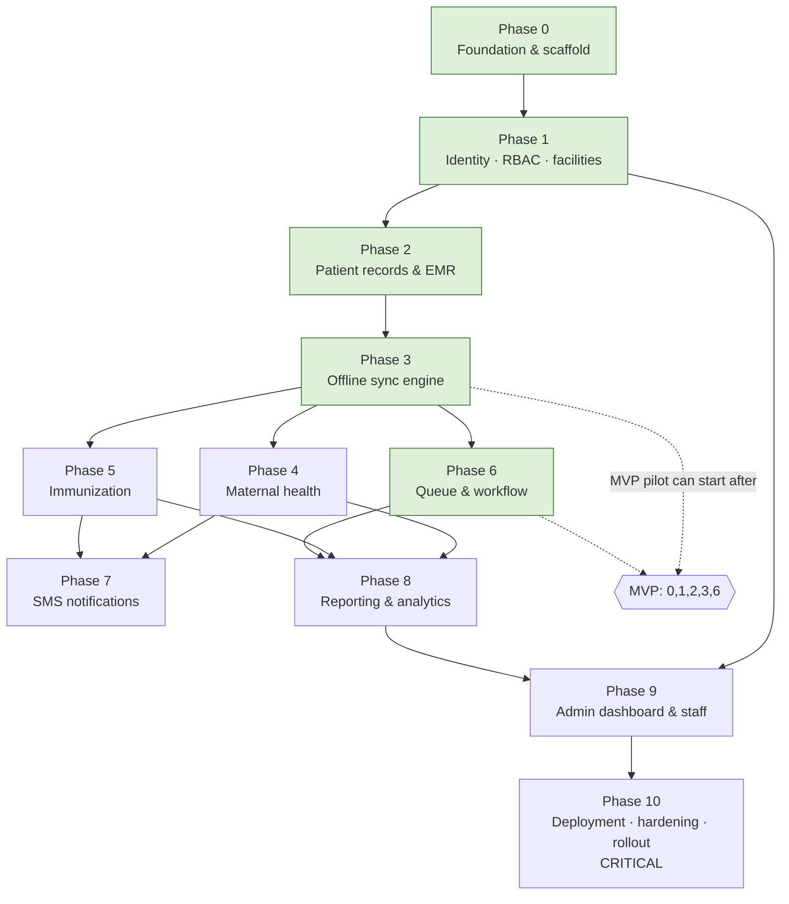

# Implementation — Per-Phase Plan Set

**Date:** 2026-06-09
**Author:** Solution architecture (planning)
**Status:** Planned
**Basis:** Expands `../master-plan.md` + the `../architecture/` and `../product/` docs into per-phase delivery docs.

---

## Context

The Nnewi North PHC Digital Health Platform is being built as an **offline-first
PWA (React + TypeScript) + NestJS + PostgreSQL**, Dockerized and self-hosted
**in-country**, syncing PHC clinic devices to a central hub, with SMS reminders
and NHMIS/DHIS2-aligned reporting. This document set breaks the build into
**11 phases (0–10)**, each independently executable, reviewable, and
change-logged.

Read the foundational docs first — they are **not** re-derived here:

- Product scope & modules: [`../product/modules-and-features.md`](../product/modules-and-features.md)
- Roles & RBAC: [`../product/user-roles-and-permissions.md`](../product/user-roles-and-permissions.md)
- Journeys: [`../product/user-journeys.md`](../product/user-journeys.md)
- Stack (locked): [`../architecture/tech-stack-recommendation.md`](../architecture/tech-stack-recommendation.md)
- System architecture: [`../architecture/system-architecture.md`](../architecture/system-architecture.md)
- Data model: [`../architecture/data-model.md`](../architecture/data-model.md)
- Offline sync: [`../architecture/offline-sync-design.md`](../architecture/offline-sync-design.md)
- API: [`../architecture/api-design.md`](../architecture/api-design.md)
- Security/compliance: [`../architecture/security-and-compliance.md`](../architecture/security-and-compliance.md)

---

## Locked decisions (authoritative — carried into every phase doc)

- **Offline-first PWA** (React + TS + Vite; Dexie/IndexedDB + service worker;
  custom change-log sync). Not native, not server-rendered-only.
- **NestJS + PostgreSQL** backend, modular monolith. **Redis + BullMQ** for jobs.
- **Monorepo** (pnpm workspaces): `apps/web`, `apps/api`, `packages/shared`,
  `infra/`, `devops/`.
- **Client-generated UUIDs** for all synced entities; **soft delete**; full
  **audit**.
- **Dockerized**, self-hosted **in Nigeria** (NDPA 2023); same Compose runs on
  NG VPS or on-prem (Open question Q6).
- **Provider-agnostic SMS**: Africa's Talking + Termii adapters.
- **Reporting** is NHMIS-aligned + **DHIS2-export**; immunization/ANC schedules
  are **editable config**, not code.
- **MVP = phases 0,1,2,3,6**; full v1 = phases 0–10 (`../master-plan.md` §5).
- All open design choices live in `../master-plan.md` §10 (Open questions
  Q1–Q9); resolve each before the phase that depends on it.

---

## Document conventions (house style)

- **Markdown-native header**, not YAML frontmatter: `# Title` → bold key/value
  metadata lines → `---` divider → content.
- Each phase doc opens with: `**Date:**`, `**Author:**`, `**Phase:**`,
  `**Depends on:**`, `**Status:**`.
- kebab-case filenames; tables for structured data; fenced code blocks with
  language hints (`ts`, `sql`, `mermaid`, `text`); `#` ATX headers.
- Every phase doc follows the same **9-section structure**: Objective →
  Prerequisites → Scope → Task breakdown → Deliverables → Acceptance/exit →
  Governance & guardrails → Risks & mitigations → Hand-off.

---

## Documents in this set

| File | Phase | MVP? |
|---|---|:--:|
| `phase-0-foundation-scaffold.md` | 0 — Foundation & scaffold | ✅ |
| `phase-1-identity-rbac-facility.md` | 1 — Identity, RBAC & facilities | ✅ |
| `phase-2-patient-records-emr.md` | 2 — Patient records & EMR | ✅ |
| `phase-3-offline-sync-engine.md` | 3 — Offline sync engine | ✅ |
| `phase-4-maternal-health.md` | 4 — Maternal health (ANC/PNC) | |
| `phase-5-immunization.md` | 5 — Immunization tracking | |
| `phase-6-queue-workflow.md` | 6 — Queue & workflow | ✅ |
| `phase-7-sms-notifications.md` | 7 — SMS notifications | |
| `phase-8-reporting-analytics.md` | 8 — Reporting & analytics | |
| `phase-9-admin-staff-management.md` | 9 — Admin dashboard & staff | |
| `phase-10-deployment-hardening.md` | 10 — Deployment, hardening & rollout (**CRITICAL**) | |

---

## Phase dependency diagram

- **Critical path to MVP:** 0 → 1 → 2 → 3 → 6 (pilot-ready).
- After Phase 3 (sync), **Phases 4, 5, 6 can run in parallel** — each is a domain
  module on top of the same offline + EMR foundation.
- **Phases 7 and 8 depend on 4+5** (they need maternal/immunization data to
  remind on and report on); 8 also needs 6 for attendance.
- **Phase 9** (admin) needs 1 (accounts) + 8 (so admin can see reports/health).
- **Phase 10 is CRITICAL / confirmation-required** — it is the production
  release + pilot rollout and touches real patient data and live SMS.

---

## Definition of Done (every phase)

A phase is **Done** only when:

1. Every box in its **Acceptance / exit criteria** is checked.
2. `lint`, `typecheck`, `test`, and `build` are green for the touched workspaces.
3. New/changed behaviour has tests (unit + the relevant e2e, including **offline
   e2e** for any clinic workflow).
4. Security/RBAC/audit obligations for the touched area are met
   (`../architecture/security-and-compliance.md`).
5. A **change-log entry** exists under `devops/change_log/<year>/<month>/`
   (`YYYY-MM-DD_phase-N-short-title.md`) recording what shipped, decisions taken,
   deviations, and any newly-surfaced open questions.
6. Any **Open question** the phase consumed (Q1–Q9) is resolved and recorded.

---

## Governance summary (applies to all phases)

- **No secrets in the repo or images** — env/secret store only; document required
  variables (NDPA + hygiene).
- **No hard deletes** of clinical data; soft-delete + audit everywhere.
- **Offline-first is non-negotiable** — any clinic workflow must pass an offline
  e2e before its phase exits.
- **RBAC + audit from Phase 1 onward**, not bolted on at the end.
- **Schedules & templates are config, not code** (immunization, ANC, SMS).
- **Phase 10 is a production release** — preview/UAT validation mandatory before
  go-live; rollback + backup/restore rehearsed.
- **Per-phase change-log entry is mandatory** (Definition of Done #5).
