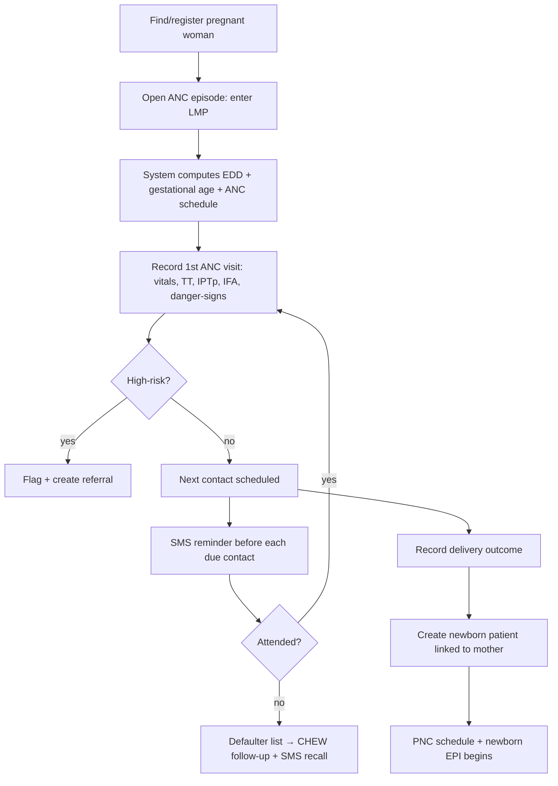
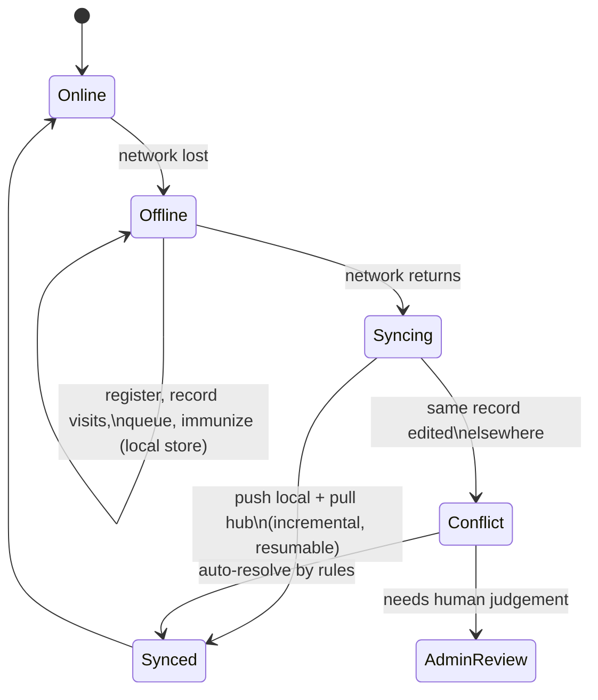

# Product Spec — Key User Journeys

**Date:** 2026-06-09
**Author:** Solution architecture (planning)
**Status:** Planned
**Reads with:** `modules-and-features.md`, `user-roles-and-permissions.md`

---

These are the end-to-end flows the system must make smooth. They are written so
a build model can turn each into screens, states, and tests. Every journey is
**offline-capable** unless noted. Each ends with the data/reporting effects so
the reporting module (Phase 8) is correct by construction.

---

## Journey 1 — Register a new patient and start a visit  *(MVP)*

**Actors:** Records Clerk → Nurse · **Modules:** 1, 2, 6

```mermaid
sequenceDiagram
  participant C as Clerk
  participant App as PWA (offline)
  participant N as Nurse
  C->>App: Search by phone "0803..."
  App-->>C: No match found
  C->>App: New patient form (name, sex, DOB, phone, address)
  App-->>C: Duplicate check → none → MRN assigned
  C->>App: Add to today's queue (reason: General)
  N->>App: Pick next from queue → open patient
  N->>App: Record vitals + complaint + assessment + treatment
  App-->>N: Visit saved to local store (timeline updated)
  Note over App: All steps work with no network; sync later
```

**Effects:** new patient + 1 encounter recorded; queue attendance +1; both sync
to hub on reconnect; feeds monthly registration & attendance figures.

**Acceptance:** completes fully offline; MRN stable post-sync; no duplicate
created; encounter appears in patient timeline immediately.

---

## Journey 2 — Returning patient, fast retrieval  *(MVP)*

**Actors:** Records Clerk / Nurse · **Modules:** 1, 2, 6

1. Clerk types the patient's **phone number** (or name/MRN).
2. Local search returns the match in < 300 ms.
3. Clerk confirms identity (DOB/photo), adds to queue with a service reason.
4. Nurse opens the **patient summary**: alerts (allergies/chronic), active
   programmes (ANC/EPI), last visit, full history — on one screen.

**Acceptance:** returning patient found and queued without re-entering
demographics; summary loads full history < 1 s on a mid-range device.

---

## Journey 3 — Antenatal care, first contact to delivery

**Actors:** Midwife (+ CHEW for follow-up) · **Modules:** 1, 2, 3, 8



**Effects:** ANC episode with scheduled contacts; visits with TT/IPTp/IFA;
referrals; delivery outcome; newborn record. All roll into the **monthly
maternal report**.

**Acceptance:** EDD and schedule computed from LMP; defaulters surface and get
SMS; delivery can spawn a linked newborn; maternal indicators report correctly.

---

## Journey 4 — Immunization on EPI day

**Actors:** Nurse (+ Clerk for queue) · **Modules:** 1, 4, 6, 8

1. Caregiver arrives with child; child found or **registered** (often the
   newborn created in Journey 3).
2. Child added to the **immunization queue/station**.
3. Nurse opens the child's **immunization card**: system shows **doses due
   today** (and any overdue) computed from DOB + configured EPI schedule.
4. Nurse records each dose given: **antigen, date, batch/lot, site, staff**;
   optional Vitamin A / deworming / growth (weight, MUAC).
5. System computes the **next due date(s)**; schedules an **SMS reminder**.
6. If the child presented late, **catch-up** logic recomputes the remaining
   schedule.
7. Any **AEFI** noted and flagged.

**Effects:** doses recorded with batch; next-due set; SMS scheduled; growth feeds
EMR vitals. Rolls into **immunization report** (coverage, dropout, defaulters).

**Acceptance:** due/overdue computed correctly; dose capture updates next-due;
overdue children appear on defaulter list; coverage & Penta1→Measles1 dropout
report correctly.

---

## Journey 5 — Manage the daily queue  *(MVP)*

**Actors:** Records Clerk + clinical staff · **Modules:** 6

1. As patients arrive, clerk **checks them in** to today's queue with a service
   reason (general / ANC / immunization).
2. The **queue board** shows waiting / in-vitals / in-consultation / completed,
   with wait-time indicators and any triage priority.
3. Staff **claim** the next patient and move them through stations.
4. On completion the visit closes; daily **attendance** updates.

**Acceptance:** queue works offline on each device; after sync, two devices at
the same facility converge to a consistent queue; attendance equals records
created.

---

## Journey 6 — Defaulter follow-up (maternal & immunization)

**Actors:** CHEW / Midwife / Nurse · **Modules:** 3, 4, 8

1. System builds **defaulter lists**: mothers who missed an ANC contact;
   children overdue for a dose.
2. **SMS recall** messages are queued (English/Igbo) for those with consent +
   phone.
3. CHEW takes the **defaulter list on a device** for community outreach
   (offline); records the outcome of each visit (found, immunized, referred,
   moved away, etc.).
4. Outcomes update the record and remove resolved cases from the list.

**Acceptance:** defaulter lists are accurate and available offline; SMS only to
consenting, reachable patients; outreach outcomes recorded and reflected.

---

## Journey 7 — Monthly reporting & DHIS2 export

**Actors:** Officer-in-charge / M&E · **Modules:** 5

1. At month end, the officer opens **Reports** and selects the facility + month.
2. The system **auto-generates** the NHMIS-aligned summary from existing records
   (registrations, ANC, deliveries, immunizations by antigen, referrals, etc.).
3. The officer reviews; each figure **drills down** to its source records.
4. The officer **locks/submits** the monthly report (figures frozen).
5. The officer **exports** a DHIS2-compatible import file (+ CSV/PDF).
6. LGA/M&E officer views **cross-facility rollups** and compares facilities.

**Acceptance:** report figures reconcile with source rows; DHIS2 file validates
against the agreed mapping; locked reports are immutable; LGA rollups exclude
drafts/deleted; data-scope respected.

---

## Journey 8 — Go offline, work, and sync back  *(MVP, cross-cutting)*

**Actors:** Any clinical user · **Modules:** 9 (and all)



**Acceptance:** every MVP action works with network disabled; on reconnect,
changes reconcile with no loss/duplication; conflicts resolve by rule or escalate
to admin; clear sync-status UI with last-synced time throughout.

---

## Journey 9 — Admin: onboard a facility & staff, configure schedules

**Actors:** System Admin / Facility Admin · **Modules:** 7, 10

1. System admin **creates the facility** (name, code, type, location).
2. Creates the **officer-in-charge** account; assigns Facility Admin role.
3. Facility admin **adds staff**, assigns roles and facility scope.
4. Admin reviews/edits **immunization schedule, ANC model, SMS templates,
   queue stations** — all as editable config.
5. Staff log in (online once to enrol; thereafter **offline-capable**).

**Acceptance:** new facility + staff can immediately operate with least-privilege
access; schedule/template edits apply to future schedules/sends without breaking
existing records.

---

## Journey 10 — Resolve a duplicate patient

**Actors:** Facility/System Admin · **Modules:** 1, 10

1. Duplicate suspected (e.g., same person registered twice across visits/sites).
2. Admin opens the **merge tool**, reviews both records side by side.
3. Admin selects the surviving MRN; histories, ANC, immunizations are **merged**
   under it; the action is **audited**.
4. Reports recompute without double-counting.

**Acceptance:** merge preserves all clinical history under one MRN, is fully
audited, and corrects any double-counting in reports.
